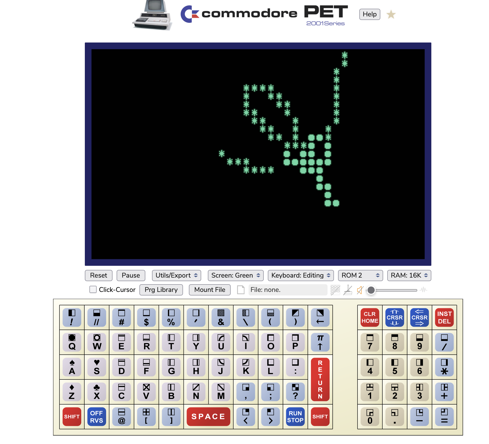

# basic-programs
I've been playing around in old versions of Microsoft BASIC on emulated 8-bit computers and came up with a couple cool programs I wanted to archive here.

* [Petplot](petplot.md) - simple subroutine to plot a single character in some x,y location on the screen of a commodore computer.
* [Dual Orbit](dualorbit.md) - a program that simulates two orbiting bodies in 2D space  
* [Trajectory](trajectory.md) - A program that plots the trajectory of a projectile launched with a certian velocity at a certain angle.  

## How to run

Copy the raw source code and paste it into a PET emulator.  If using a C64 or 80 column PET see [petplot](petplot.md) to change the plot routine at line 2000.

### Desktop emulator
Easy to run in VICE or similar emulator of Commodore systems.

https://vice-emu.sourceforge.io

You can copy and paste the code into vice emulator, as well as copy the screen contents from vice.

### Web page emulator
There are also many free online Javascript based emulators offered in exchange for putting some advertisements in front of your eyes.

I'm not affiliated or endorsing any but have tested this code on this PET 2001 emulator. 

https://www.masswerk.at/pet/

Select and copy the BASIC code, then in the emulator right-click inside the screen and select "Paste to PET" it will pop up a little 'paste' button you have to click to actually paste the text to pet.