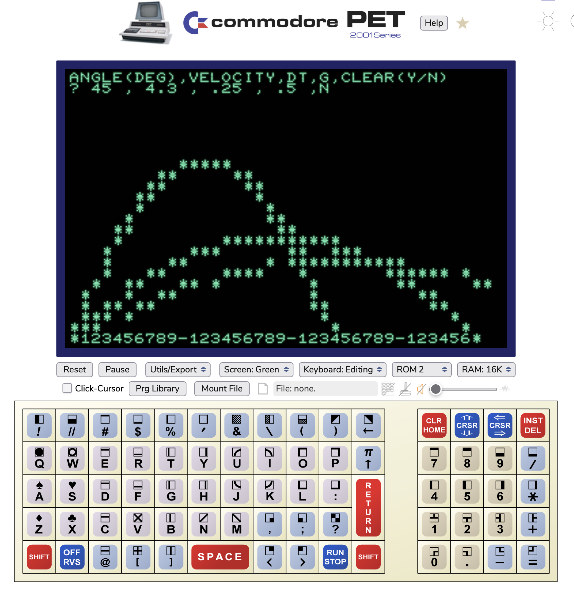

# basic-programs
I've been playing around in old versions of Microsoft BASIC on emulated 8-bit computers and came up with a couple cool programs I wanted to archive here.

* [Petplot](petplot.md) - simple subroutine to plot a single character in some x,y location on the screen of a commodore computer.
* [Dual Orbit](dualorbit.md) - a program that simulates two orbiting bodies in 2D space  
* [Trajectory](trajectory.md) - A program that plots the trajectory of a projectile launched with a certian velocity at a certain angle.  