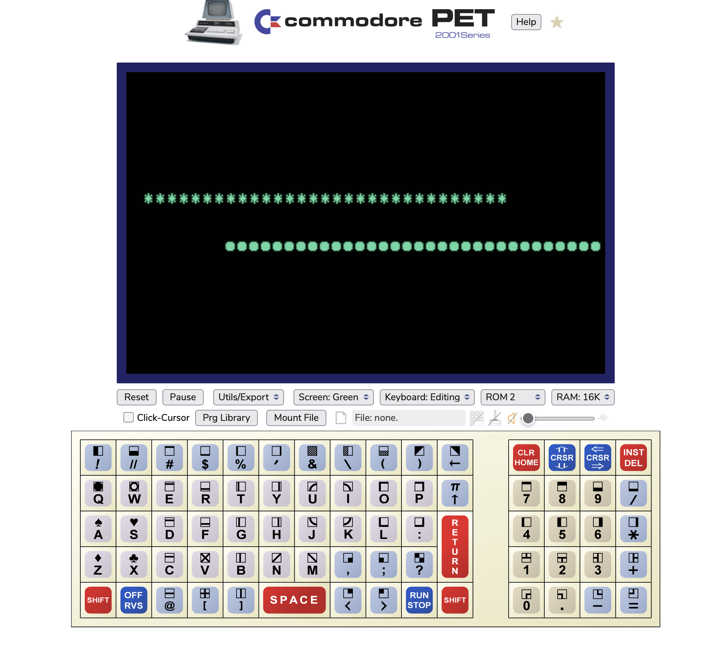
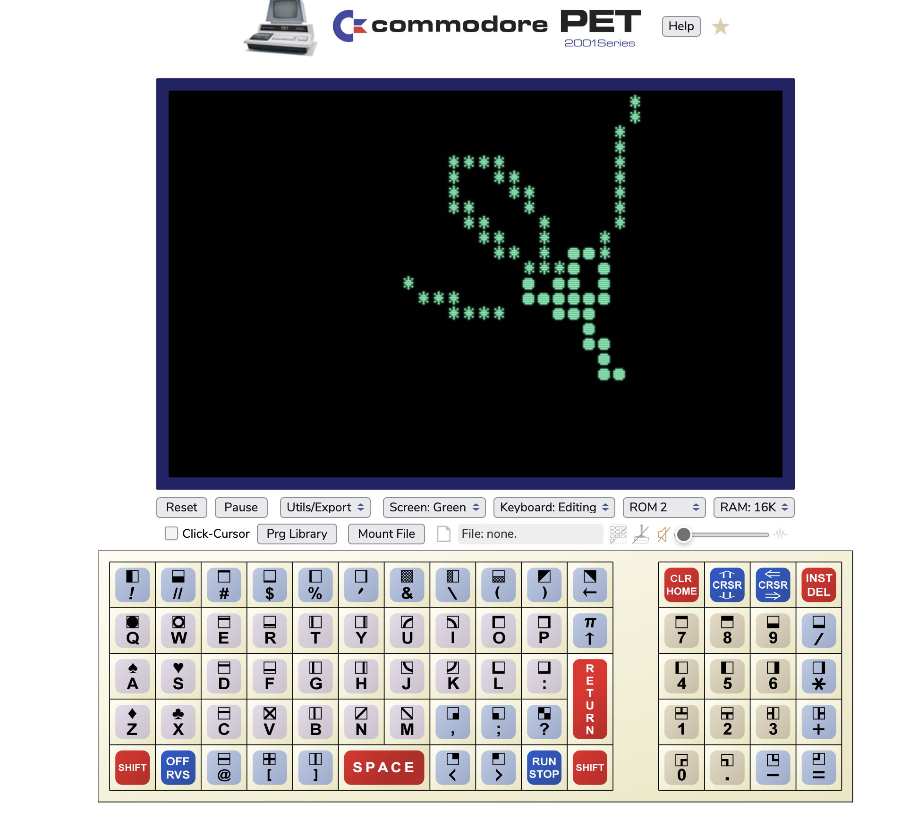

# Dual Orbit 
Short MS Basic program that simulates 2 bodies under mutal gravitational attraction.

## Summary
You setup the mass and initial x,y location and x,y velocity for two on screen objects which are rendered as single characters (an asterix and a dot).

When the program runs it goes into an infinite loop.  In each iteration it updates the position based on velocity, and the velocity based on x,y accelerations calculated in each iteration based on relative position and masses of the two bodies per Newtonian mechanics.  The two objects are rendered onto the screen repeatedly in different locations drawing out their path through 2 dimensional space.

The "Gravitational Constant" G is 1, the units of distance are one character width or hieght, the unit of time is one iteration of the loop.

Mass is simply used as a coefficent to calculate the acceleration see below details.

## How to run

### Desktop emulator
Easy to run in VICE or similar emulator of Commodore systems.

https://vice-emu.sourceforge.io

You can copy and paste the code into vice emulator, as well as copy the screen contents from vice.

### Web page emulator
There are also many free online Javascript based emulators offered in exchange for putting some advertisements in front of your eyes.

I'm not affiliated or endorsing any but have tested this code on this PET 2001 emulator. 

https://www.masswerk.at/pet/

Select and copy the BASIC code, then in the emulator right-click inside the screen and select "Paste to PET" it will pop up a little 'paste' button you have to click to actually paste the text to pet.

### Important variable names and meaning
Lines 20 and 30 are used to setup the initial values.

There are two bodies, "object" "o" rendered as an asterix, and "thing" "t" rendered as a dot.
o(2,3) is an array of 3 x,y numbers for "o".  Similarly with t(2,3)
```
  0 | 1
---------
0 x | y  -  Position on Screen
1 x | y  -  Velocity in each dimension
2 x | y  -  Acceleration in each dimension leave 0 and let loop change this.
```
So in line 20 set o(0,0) to object's inital x location, and o(0,1) to object's initial y location.
Set o(1,0) to object's initial velocity in X  direction, positive goes right, negative goes left.
Set o(1,1) to object's initial velocity in Y direction, positive goes down, negative goes up.
Do the same for thing's initial values in line 30.

The last variable om, and tm, are the masses, 0 makes them not attract the other body at all, bigger values makes them attract the other more, and also makes a body harder to move.

## Example inital values

* No gravity example.  Starting "object" on the left edge of the screen at 0,10 with a velocity of .5 going straight left (y velocity is 0), "thing" starts on the right edge at 39,14 going right at .5 (-.5 x velocity and 0 y velocity).  Setting both masses to 0 effectively turns off gravity and they simply move past eachother as if the other is not there.

``` 
20 o(0,0)=0:o(0,1)=10:o(1,0)=.5:o(1,1)=0:om=0
30 t(0,0)=39:t(0,1)=14:t(1,o)=-.5:t(1,1)=0:tm=0
```


```
 20 o(0,0)=0:o(0,1)=10:o(1,0)=.5:o(1,1)=0:om=1
 30 t(0,0)=39:t(0,1)=14:t(1,o)=-.5:t(1,1)=0:tm=1
```

* Same as above but this time both bodies have mass of one.  Now they interact with eachother and their trajectories curve and they both get ejected in different directions at the same rate.


* Thing is 3 times more massive than object and starting near each other with small velocities in different directions.  The interaction leads to both stars being ejected, the smaller object being ejected sooner and faster than heaver thing.

```
 20 o(0,0)=15:o(0,1)=12:o(1,0)=.2:o(1,1)=.2:om=1
 30 t(0,0)=25:t(0,1)=12:t(1,o)=.0:t(1,1)=-.1:tm=3
```



* One of my favorites, setting the bodies in tangential motion sets up for more stable orbits if you get the ratios of the masses and velocities just right.  This one with thing ten times more massive than object has a neat stable orbit that looks like a big planet orbiting a star or a smaller star orbiting a larger one.

```
 20 o(0,0)=15:o(0,1)=12:o(1,0)=.0:o(1,1)=1.0:om=1
 30 t(0,0)=25:t(0,1)=12:t(1,o)=.0:t(1,1)=-.10:tm=10
```


## Gory math details

### Equations

Newtons second law states that the force needed to accelerate an object is proportional to its mass.

$f=ma$

From that we simply rearrange to get acceleration equals force divided by mass.

$a=\frac{f}{m}$

Newtons equation for the force of gravity.

$f_g=G\frac{Mm}{d^2}$

Rearanging for acceleration of the smaller mass gives.

$a_m=\frac{GMm}{md^2}$

Simplifying the m's cancel, and we are using G=1 in our universe, each bodies acceleration can be easily calculated given their distance.

$a_m=\frac{M}{d^2}$

$a_M=\frac{m}{d^2}$

This gives us the acceleration in the direction toward the other body.  We need to convert that into two accerelations in each X and Y dimension.
This is done by multiplying the total acceleration by the sine or cosine of the angle between them.

The amount of total acceration in the straight line direction toward the other body that is solely in the X direction can be calulated by multiplying the total acceleration by the difference in the X direction divided by the actual distance.

$a_mx=a\frac{\Delta x}{d}$

Assuming we calculated the deltas only once from m's perspective, and substituting the total acceleration equations above for "a" we get these four equations for X and Y for each object.

$a_mx=\frac{M\Delta x}{d^3}$

$a_my=\frac{M\Delta y}{d^3}$

$a_Mx=-1\frac{m\Delta x}{d^3}$

$a_My=-1\frac{m\Delta y}{d^3}$


What I mean about "m's perspective" is that in our computer screen dimensions, if we are calculating delta X, and we M's X minus m's X then if M is left of m, we will get a negative number which will accelerate us toward the left, likewise if M is right of m, we will get a positive number accelerating us right.  For moving M toward m, we would have opposite signs but calculate the same magnitude for delta x and delta y so in the bottom two equations I multiplyed M's acceleratinos by negative 1.

This is all in the code at lines 40-70.
```
40 dx=t(0,0)-o(0,0):dy=t(0,1)-o(0,1)
50 d2=dx^2+dy^2:d3=d2*sqr(d2)
60 o(2,0)=tm*dx/d3:o(2,1)=tm*dy/d3
70 t(2,0)=-1*om*dx/d3:t(2,1)=-1*om*dy/d3
```

* Line 40 calculates the delta X and delta Y from "objects" perspective, so the calculated X and Y accelerations will have a sign that moves "object" toward "thing".
* Line 50 uses that to calculate the distance squared, and multiplyes the distance squared by the distance to get the distance cubed needed for the acceleration equations.
* Line 60 calculates "object"'s X and Y acceleration and stores them in o(2,0) and o(2,1) respectively.
* Line 70 does same for "thing"'s X and Y multiplying by negative one to correct for the sign of delta X and delta Y being for "object".

The lines 80-110 add "object"'s X acceleration to its X velocity, its X velocity to its X position, Y acceleration to Y velocity, Y velocity to Y position for one iteratiton.  Lines 120-150 do the same for "thing".

Lines 160-190 plot the two objects using the petplot routine.  First plotting a "space" (poke code 32) then each objects character, 42 asterix for "object" and 81 dot for "thing".  Plotting a space first makes it flash a bit if an object returns to a spot already drawn on and allows you to see where it currently is if its in a stable orbit or otherwise crossing an existing path.


