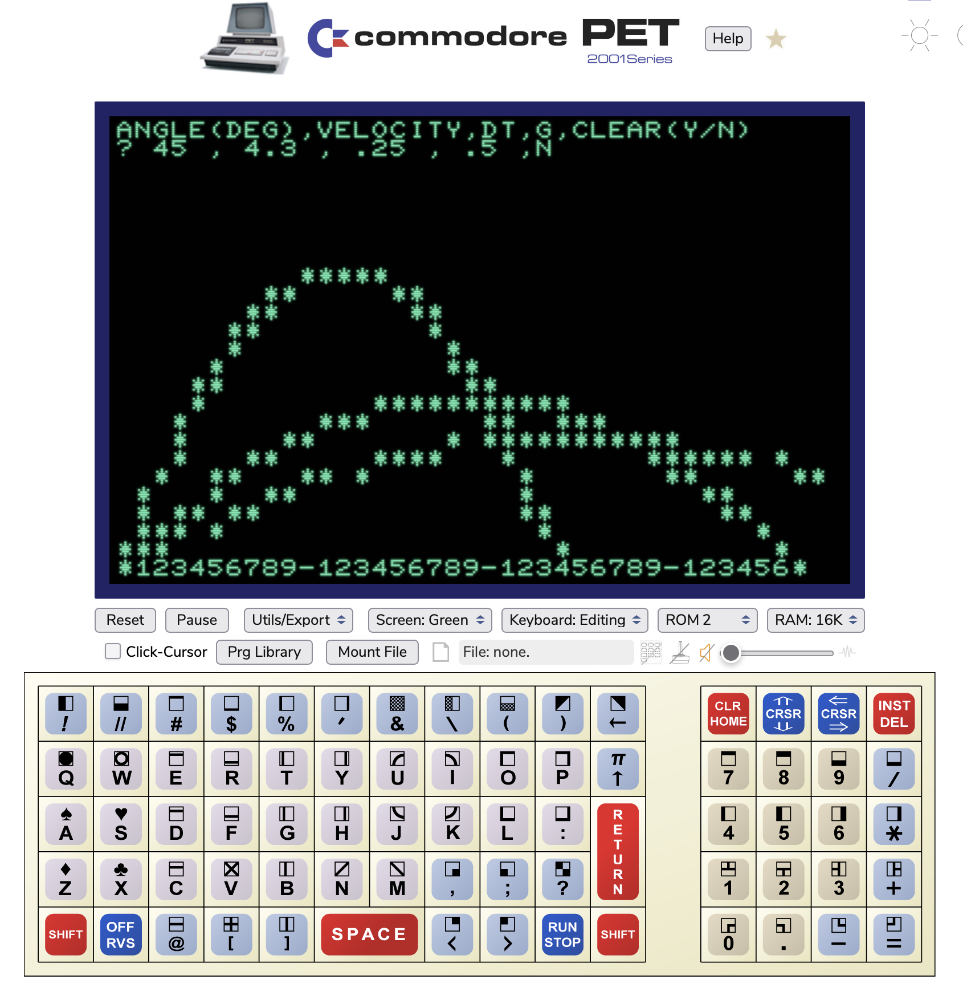

# Trajectory
Simple program to plot the trajectory of a projectile launched at a certain angle and speed under influence of gravity.

On the first run a plot is made of the trajectory of a projectile launched from the lower left corner of the screen at an angle of 60 degrees, velocity of 4.2.

After the first run the user is asked to update the initial quantities for angle in degrees, initial velocity along that angle, how much time passes per loop (dt), acceleration of gravity g, and whether or not to clear the screen for the next launch.

## Units
X and Y positions are screen coordinates, so distance is one screen character width or height.  Likewise velocity will then be one character length per time interval (dt), and acceleration in one character per time interval per time interval.

So if we call our distance unit of one character length one "c" then:
* Distance x is in units of $c$.
* Velocity v is in units of $c/dt$.
* Acceleration a is in units of $c/dt^2$

Think of it like having a high speed camera filming a projectile.  If you filmed at 60 frames per second, then each frame would be 1/60th of a second.  If you played it back at 60 frames per second the video would play in real time.  Now imagine you can film at 240 frames per second, then each frame would be 1/240th of a second, if you play it back at 60 frames per second it would be in 'slow motion' playing at 1/4 speed.

## Computational Reducability

Normally when I create physics in computer programs for say a game or a bouncing ball, I usually just iteratively add acceleration to velocity and velocity to location each iteration.  This approach fixes the unit of time to one loop iteration, and fixes all velocity and acceleration units to loop iteration.  The approach used in line 230 does not do that.

Line 230 uses a computation that can calculate in a single go the x and y position of the projectile at ANY time.  If we assume the 'base' unit of time is the "iteration of a loop" then we can calculate where the projectile would be at say the 5th iteration, or the 15th, or the .5 iteration, or the 12.125 iteration.   

Line 231 is an alternative calculation to update the position of the projectile using iterative addition.  Remark out line 230 and remove the remark from line 231 to try that alternative.  The program works the same way but the dt value has no meaning or function.  In this mode dt is effectively fixed to 1.

While writing this and the [Dual Orbit](dualorbit.md) program I got to thinking about the difference between the two approaches to modeling the physics of moving bodies and how for these simple examples either approach can be used.  It reminds me of Stephan Wolfram's [Observer Theory](https://writings.stephenwolfram.com/2023/12/observer-theory/) in which he describes computational reducability, the ability to reduce a computation so we can "skip ahead" and just calculate the state of the system at any future time.  This program does that with the trajectory of the projectile in line 230.  He also talks about other problems which are computationally irreducable, where there is no "short cut" and the only way to calculate the state of the system is to start with initial conditions and allow it to evolve, like this program will if you use 231 instead.
